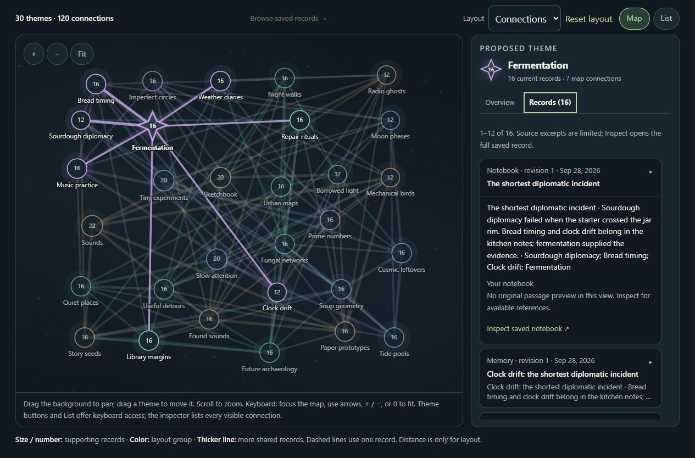

# PCS - Your personal thinking space

**Room to think. Space to connect.**

The public website for PCS: a Windows application for conversation, learning and memory you can inspect and revise.

**[Visit the website](https://pcs-personalcontinuitysystem.github.io/PCS-site/)** · [Download PCS 0.9.33](https://github.com/PCS-PersonalContinuitySystem/PCS/releases/download/v0.9.33/PCS-0.9.33-Windows-x64.zip) · [Release notes](https://github.com/PCS-PersonalContinuitySystem/PCS/releases/tag/v0.9.33) · [Discord community](https://discord.gg/Tfd4kHQun)

*PCS 0.9.33 interface · Default theme · Invented sample data. [Open the detailed Map](screenshots/pcs-map-detail-0933.jpg).*

## A wider view of your saved thoughts

Talk through an idea, explore a question, and return to what matters. PCS brings conversation, notebooks, reading materials, local plans and revisable memory into a space you control. Choose Google, OpenAI or a supported Local model while keeping your vault.

The **Continuity Map** displays recurring wording and topic labels from saved memories and notebooks. Follow a connection and inspect its supporting records. Links represent shared saved content; they do not establish causation or detect hidden beliefs. Browse locally without an AI request and save your layout in the encrypted vault. In **Library**, review a **Continue this thought** draft before bringing a thread into conversation.

## This website update

- **Current pictures:** seven refreshed 0.9.33 interface captures, a denser Map with unusual connections, and plans spread across a full month. All examples use invented data.
- **Clearer setup:** a visible recommendation for an NVIDIA GPU with at least **16 GB VRAM** for a smooth Local experience. Needs vary by model, context and optional features; Google and OpenAI cloud routes do not require a 16 GB GPU.
- **Current guidance:** Local cancellation and voice controls, draft recovery, pasted web sources, launch-link privacy, and the 2 GiB native backup/restore limit.
- **Community:** Discord links alongside optional Ko-fi support, plus a subscription FAQ covering both Google and OpenAI.

PCS is free and open source under GPL-3.0-only, with no PCS subscription or locked features. Cloud API access has provider-specific terms and possible charges. The Windows package includes Python and ordinary dependencies for offline installation. Optional Local models, runtimes, listening and voice packs are separate downloads.

Local storage and external sharing are separate choices. Cloud features receive permitted content. Optional Brave queries and requested page fetches leave the PC; separately approved preparation can use its displayed cloud provider. **Don’t save this conversation** controls PCS saving, not provider retention. Original local Materials files and readable exports are outside vault encryption.

## Pages

| Page | Purpose |
| --- | --- |
| [index.html](index.html) | Introduction, features, downloads and FAQ |
| [continuity-map.html](continuity-map.html) | Themes, supporting records, layouts and coverage |
| [getting-started.html](getting-started.html) | Setup, Local hardware, upgrades and recovery |
| [memory-control.html](memory-control.html) | Reviewing, correcting and backing up continuity |
| [data-and-privacy.html](data-and-privacy.html) | Vault, cloud, Local and sharing boundaries |

## Upload and preview

This is a complete static website with **no build step**. Extract the upload ZIP and copy its contents to the root of `PCS-PersonalContinuitySystem/PCS-site`, replacing same-named files. Keep `index.html`, `.nojekyll`, guides and asset folders at that level; preserve existing deployment or custom-domain configuration. Older unused assets may remain.

See [UPLOAD-INSTRUCTIONS.md](UPLOAD-INSTRUCTIONS.md). For a local preview, serve the extracted folder with `python -m http.server 8000` and visit `http://localhost:8000/`.

The five HTML files are the editable source. Download links, FAQs and image links work without JavaScript; a small script adds mobile navigation and image previews. Keep version labels, download links, metadata and guides in agreement. Historical vault minimum-reader versions are compatibility facts, not release labels to replace.

[SCREENSHOTS.md](SCREENSHOTS.md) explains the examples. `SCREENSHOT-MANIFEST.json` records dimensions, hashes and provenance; `PUBLICATION-MANIFEST.json` records the delivered files. `WEBSITE-CHECKS.json` describes website validation, not live provider or hardware certification.

## Links and support

[Application repository](https://github.com/PCS-PersonalContinuitySystem/PCS) · [Matching source](https://github.com/PCS-PersonalContinuitySystem/PCS/releases/download/v0.9.33/PCS-0.9.33-Source.zip) · [Checksums](https://github.com/PCS-PersonalContinuitySystem/PCS/releases/download/v0.9.33/PCS-0.9.33-SHA256SUMS.txt) · [Report an app bug](https://github.com/PCS-PersonalContinuitySystem/PCS/issues) · [Website issues](https://github.com/PCS-PersonalContinuitySystem/PCS-site/issues) · [Discord](https://discord.gg/Tfd4kHQun)

[Support PCS on Ko-fi](https://ko-fi.com/pcssupport). Support is optional; no features are locked behind payment. Review reports before posting and remove private information.
