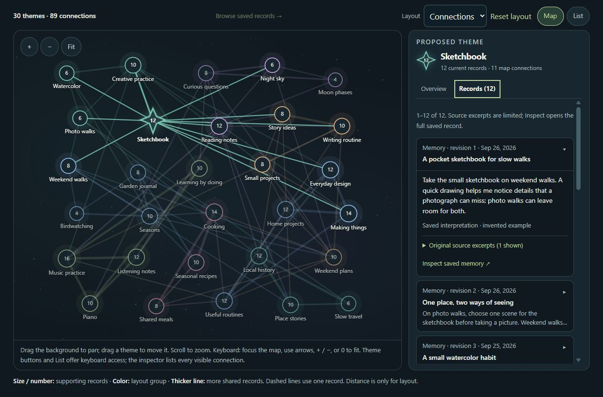

# PCS — Personal Continuity System

**Room to think. Space to connect.**

This repository contains the public PCS website: a Windows AI companion for conversation, learning and continuity you can inspect and revise.

**[Visit the website](https://pcs-personalcontinuitysystem.github.io/PCS-site/)** · [Download PCS 0.9.24 for Windows](https://github.com/PCS-PersonalContinuitySystem/PCS/releases/download/v0.9.24/PCS-0.9.24-Windows-x64.zip) · [Release notes](https://github.com/PCS-PersonalContinuitySystem/PCS/releases/tag/v0.9.24) · [Application repository](https://github.com/PCS-PersonalContinuitySystem/PCS)

*PCS 0.9.24 interface · Default PCS theme · Illustrative sample: 30 themes, 89 connections and 96 fictional records. [Open the detailed view](screenshots/pcs-map-detail-0924.jpg).*

## A wider view of your saved thoughts

An idea in a notebook. A recurring question. A connection worth looking at again. The **Continuity Map** brings recurring wording and topic labels from saved memories and notebooks into view. Select a theme, follow a connection and inspect the records behind it. A different question—or a fresh perspective—can begin there.

Links mean the labels occur together in supporting records. The Map is a bounded local overview, not a psychological profile or a claim to detect hidden beliefs. You interpret what the connections mean. It needs no running AI conversation; layout positions can be saved in the encrypted vault. In the neighboring **Library**, review a **Continue this thought** draft before bringing a saved thread into conversation.

PCS also includes typed and spoken conversation, revisable memory with source evidence and history, Materials and notebooks, Research and Practice tools, and local tasks, goals and events. Choose Google, OpenAI or a supported Local model while keeping your vault.

## Updated for 0.9.24

- **Conversation first:** the original welcoming homepage framing and Conversation screen, followed by a detailed Map feature and dedicated guide.
- **Current Local features:** guided Gemma setup, experimental Custom GGUF profiles, optional OBS vision, Brave lookup, separate speech downloads and Kokoro CPU/NVIDIA voices.
- **Speech and reliability:** Skip speech for current/queued Local playback, spoken Markdown cleanup, saved Map layouts, notebook draft protection, Calendar fixes and clearer backup limits.
- **Fresh samples:** current interface captures using invented data, including the default PCS theme. See [SCREENSHOTS.md](SCREENSHOTS.md) for exactly how they were made and what they demonstrate.
- **Current downloads and guides:** Windows, matching source and checksum links all target the published 0.9.24 pre-release.

PCS is free and open source under GPL-3.0-only, with no PCS subscription or locked features. Cloud providers may charge separately. Local conversation needs compatible Windows/NVIDIA hardware and downloaded model/runtime assets; ordinary saved-record browsing and cloud use do not require an NVIDIA GPU. The Windows package includes ordinary Python and application dependencies for offline installation. Optional AI and speech packs are separate downloads.

Local storage and external sharing are separate. Cloud features receive permitted content. Optional Brave queries and requested page fetches leave the PC; separately approved preparation can use its displayed cloud provider. “Don’t save this conversation” controls PCS saving, not provider retention. Original local Materials files and readable exports are outside vault encryption. Manual and automatic encrypted backup/restore are limited to 256 MiB; larger vaults use the documented fully stopped data-folder procedure.

## Website pages

| Page | Purpose |
| --- | --- |
| [index.html](index.html) | Conversation-led introduction, Map feature, route comparison, downloads and FAQ |
| [continuity-map.html](continuity-map.html) | Themes, evidence, layouts, dates, paths and coverage |
| [getting-started.html](getting-started.html) | Windows setup, optional components, upgrades and recovery |
| [memory-control.html](memory-control.html) | Reviewing, correcting, retaining and backing up continuity |
| [data-and-privacy.html](data-and-privacy.html) | Vault, cloud, Local, web lookup and sharing boundaries |

## Upload or preview

This is a **complete static website**, ready for GitHub Pages. There is no build step, npm install, API key or server application. The site does not connect to a PCS vault or call an AI provider.

1. Extract the upload ZIP locally.
2. Upload **the extracted contents** to the root of `PCS-PersonalContinuitySystem/PCS-site`. Keep `index.html`, `.nojekyll`, the four guide pages and the asset folders at that level. Do not upload only the ZIP or nest the site in an extra folder.
3. Replace same-named files. Preserve the repository’s existing Pages deployment configuration and any custom-domain configuration.
4. Wait for the existing GitHub Pages deployment, then check the main page, Map image, guides, download buttons and mobile navigation.

See [UPLOAD-INSTRUCTIONS.md](UPLOAD-INSTRUCTIONS.md) for the exact checklist. The package is self-contained; it does not depend on old files already being in the repository. Legacy unused assets in an existing repository do not need to be removed during this upload.

For a local preview, serve this folder with any static HTTP server, for example `python -m http.server 8000`, then visit `http://localhost:8000/`. Opening HTML directly also provides the static content. Downloads are ordinary links; FAQs use native details/summary. The small script adds an accessible mobile menu and image previews, with normal image-link fallbacks when JavaScript is unavailable.

## Maintaining the site

The five HTML files are the editable source. Keep their version labels, release/download links, JSON-LD software version and supporting guides in agreement. Do not globally replace historical minimum-reader versions; those are compatibility facts.

- `website-0924-r2.css` adds small guide-image refinements. The original homepage framing, PCS styles and brand assets are retained.
- `assets/site-controls-0924.js` handles navigation and image previews. Its filename is an asset revision, not the advertised application version.
- `screenshots/` contains the images actually referenced by this publication bundle.
- `SCREENSHOT-MANIFEST.json` records image dimensions, hashes and provenance.
- `WEBSITE-CHECKS.json` records this package’s local validation. Website checks do not certify live provider, device or model behavior.

Keep image captions honest. These samples show the real 0.9.24 frontend with invented data and isolated fixture responses; they are not private records or evidence of a live AI answer. The website does not promise exhaustive recall, semantic mind mapping, autonomous desktop awareness or universal hardware compatibility.

## Links and support

[Application source ZIP](https://github.com/PCS-PersonalContinuitySystem/PCS/releases/download/v0.9.24/PCS-0.9.24-Source.zip) · [Checksums](https://github.com/PCS-PersonalContinuitySystem/PCS/releases/download/v0.9.24/PCS-0.9.24-SHA256SUMS.txt) · [Application issues](https://github.com/PCS-PersonalContinuitySystem/PCS/issues) · [Website issues](https://github.com/PCS-PersonalContinuitySystem/PCS-site/issues) · [Discord](https://discord.gg/558hSvYp4)

[Support PCS on Ko-fi](https://ko-fi.com/pcssupport). Support is optional; no PCS features are locked behind payment. Review bug reports before posting them publicly and remove private information.
