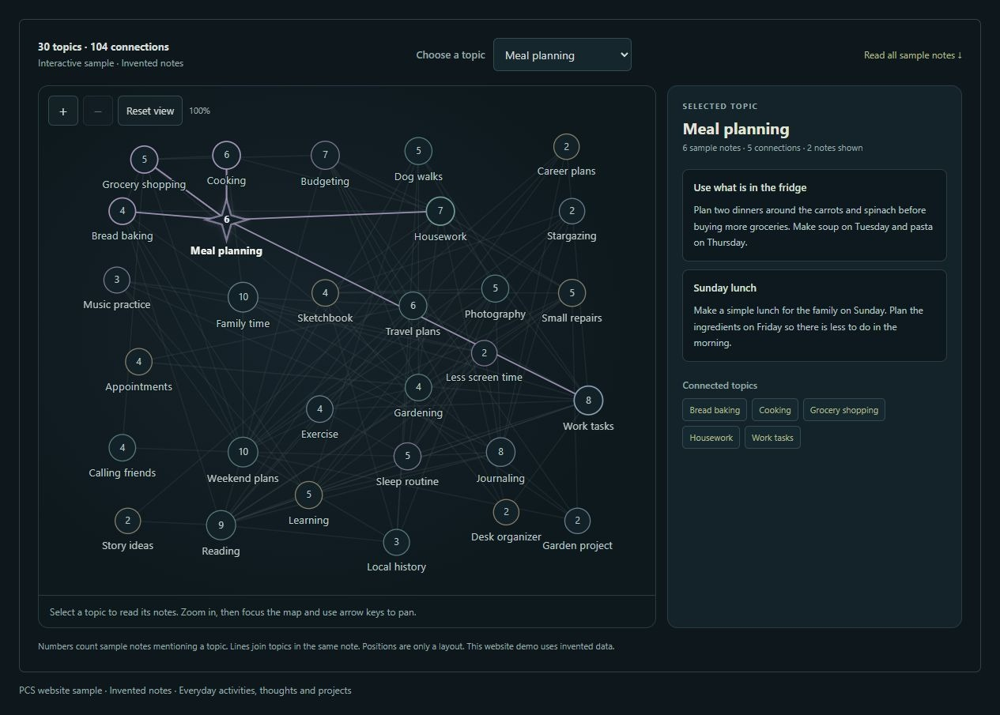

# PCS — AI conversations, notes and memory for Windows

**Room to think. Space to connect.**

PCS is a Windows app for AI conversations, saved memories, notebooks and plans. Use Google, OpenAI or a supported local model. Review and correct what PCS saves.

**[Website](https://pcs-personalcontinuitysystem.github.io/PCS-site/)** · [Download PCS 0.9.33](https://github.com/PCS-PersonalContinuitySystem/PCS/releases/download/v0.9.33/PCS-0.9.33-Windows-x64.zip) · [Release notes](https://github.com/PCS-PersonalContinuitySystem/PCS/releases/tag/v0.9.33) · [Discord](https://discord.gg/Tfd4kHQun)

## What PCS does

- **Conversation:** type or use a microphone to ask questions, work through a problem or discuss a document.
- **Saved memory:** with learning enabled, PCS can save details from conversations and retrieve relevant records later. Inspect their source passages, correct mistakes and compare revisions. PCS can miss details or retrieve the wrong record.
- **Materials and notebooks:** organize documents, your notes, prepared reading notes and saved web text. Link sources to a notebook for later discussion or study.
- **Calendar:** store local tasks, goals and events. Enable AI assistance separately and check the saved result. Calendar has no account sync, invitations or reminders.
- **Continuity Map:** browse topics shared by saved memories and notebooks. Read the records behind a connection. Browsing makes no AI request; a line does not establish causation or hidden beliefs.

Saved records stay in an encrypted vault on your PC. Cloud conversations and enabled sharing send content to selected providers. Original local document files and readable exports are outside vault encryption. **Don’t save this conversation** pauses new PCS saving; it does not stop cloud processing or erase earlier records.

PCS is free and open source under GPL-3.0-only. There is no PCS subscription or paid feature tier. Cloud API access has provider-specific terms and possible charges. Optional support on [Ko-fi](https://ko-fi.com/pcssupport) is separate from using the app.

For a smooth Local experience, we recommend an NVIDIA GPU with **at least 16 GB VRAM**. Needs vary by model, context and optional features. Google and OpenAI cloud routes do not require that GPU capacity. Local models, runtimes and optional voice packs are separate downloads.

## Website revision 4

This update restores only the main **Room to think. Space to connect.** tagline. The other headings, feature descriptions, guides and search/social metadata retain the clearer wording from revision 3. The interactive Map uses **22 everyday activities out of 30 topics (73%)**, with a few thoughts and projects: career plans, less screen time, a garden project and a desk organizer. It contains **48 invented notes** and **104 displayed connections**, with counts derived from those notes. Selected stars, glows and highlighted connections keep each node's original color. Two new Map previews match the demo. Existing product screenshots are retained.

Theme selection, connected-topic links, zoom, keyboard access and a complete text alternative remain available. All feature copy, guide text and sample notes are ordinary HTML. Interaction requires no external library, makes no network or AI request and stores no user data.

## Pages

| Page | Purpose |
| --- | --- |
| [index.html](index.html) | Features, download and FAQ |
| [continuity-map.html](continuity-map.html) | Topics, supporting records and Map limits |
| [getting-started.html](getting-started.html) | Setup, Local hardware, upgrades and recovery |
| [memory-control.html](memory-control.html) | Saving, recall, corrections and backups |
| [data-and-privacy.html](data-and-privacy.html) | Vault encryption and online sharing |

## Upload and preview

This is a complete static website with **no build step**. Extract the upload ZIP and copy its contents to the root of `PCS-PersonalContinuitySystem/PCS-site`, replacing same-named files. Keep `index.html`, `.nojekyll`, guides and asset folders at that level. Preserve existing deployment and custom-domain configuration. Older unused assets can remain.

See [UPLOAD-INSTRUCTIONS.md](UPLOAD-INSTRUCTIONS.md). Preview locally with `python -m http.server 8000 --bind 127.0.0.1`, then open `http://127.0.0.1:8000/`.

The HTML files are editable source. Small scripts add mobile navigation, image previews and Map interaction. [SCREENSHOTS.md](SCREENSHOTS.md) describes sample provenance. `SCREENSHOT-MANIFEST.json` records image dimensions and hashes; `PUBLICATION-MANIFEST.json` records the delivered files. `WEBSITE-CHECKS.json` describes website validation, not live app, provider or hardware acceptance.

## Project and support

[Application repository](https://github.com/PCS-PersonalContinuitySystem/PCS) · [Matching source](https://github.com/PCS-PersonalContinuitySystem/PCS/releases/download/v0.9.33/PCS-0.9.33-Source.zip) · [Checksums](https://github.com/PCS-PersonalContinuitySystem/PCS/releases/download/v0.9.33/PCS-0.9.33-SHA256SUMS.txt) · [Report an app bug](https://github.com/PCS-PersonalContinuitySystem/PCS/issues) · [Website issues](https://github.com/PCS-PersonalContinuitySystem/PCS-site/issues) · [Discord community](https://discord.gg/Tfd4kHQun)

Review screenshots and reports before sharing. Remove private information from public posts.
